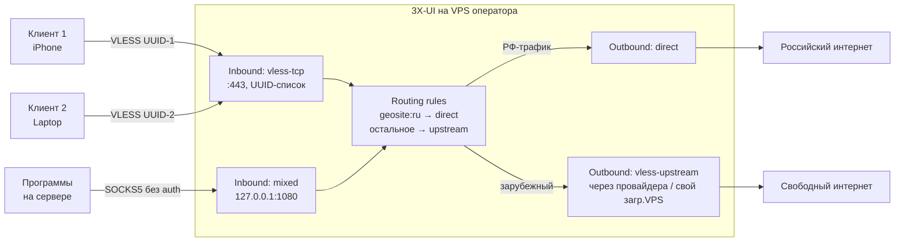

# 3X-UI: архитектура панели и операционные грабли

Этот документ — справочник по эталонной реализации 3X-UI (`MHSanaei/3x-ui`).
Покрывает архитектуру, файловую раскладку, CLI, TLS-выпуск, Telegram-бот,
известные подводные камни. Описание REST API — отдельно в `3x-ui-api.md`.

Читают: персона при ответах на вопросы про панель; скиллы `/setup-vpn-panel`,
`/configure-vpn-routing`, `/setup-server-proxy`, `/generate-client-config` при
любых операциях с панелью.

---

## 1. Архитектура: четыре сущности

### 1.1 Логическая модель

3X-UI — это веб-панель + REST API + Telegram-бот над ядром Xray-core. Сама
панель — Go-приложение, хранит конфигурацию в SQLite, перезаписывает конфиг
Xray и перезапускает процесс xray-ядра при изменениях.

Модель данных панели — четыре сущности:

| Сущность | Назначение | Аналогия |
|---|---|---|
| **Inbound** | Точка приёма трафика от клиентов | Входная дверь дома |
| **Outbound** | Точка отправки трафика наружу | Выходная дверь дома |
| **Routing rule** | Правило, какой inbound через какой outbound | Охранник, направляющий потоки |
| **Client** | Пользователь, имеющий доступ к inbound | Ключ от входной двери |



### 1.2 Несколько inbound и несколько outbound на одной панели

3X-UI поддерживает множество inbound и множество outbound одновременно.
Типовая боевая конфигурация:

- **Inbound 1** — VLESS-TCP на 443, для клиентов-устройств (Hiddify/Karing
  на iPhone, Hiddify/NekoBox на Android, sing-box/Hiddify на desktop).
  Множество clients (UUID на устройство-человека-роль).
- **Inbound 2** — mixed на 127.0.0.1:1080, для программ на этом же сервере.
- **Outbound 1** — direct (для РФ-трафика).
- **Outbound 2..N** — VLESS upstream (либо подписка провайдера, либо свой
  загр.VPS).
- **Balancer 1** — собирает Outbound 2..N через стратегию `leastPing`.

### 1.3 Балансировщики

Если outbound-ов несколько (несколько серверов в подписке провайдера,
несколько своих загр.VPS), они собираются в `balancer`:

```json
{
  "tag": "upstream-balancer",
  "selector": ["upstream"],
  "strategy": { "type": "leastPing" },
  "fallbackTag": "direct"
}
```

- `selector: ["upstream"]` — выбирает все outbound с tag, начинающимся на
  `upstream` (так удобно: `upstream-de`, `upstream-nl`).
- `strategy.type` — `random`, `roundRobin`, `leastPing`, `leastLoad`.
  `leastPing` и `leastLoad` требуют включённого `observatory` (модуль
  мониторинга outbound health).
- `fallbackTag` — куда уходит трафик, если все upstream-ы недоступны.

Маршрутизация ссылается на балансировщик через поле `balancerTag` (а не
`outboundTag`):

```json
{
  "type": "field",
  "balancerTag": "upstream-balancer",
  "inboundTag": ["vless-in", "mixed-in"]
}
```

### 1.4 Observatory (мониторинг outbound)

`observatory` — фоновой модуль Xray, который раз в N секунд пингует endpoint
от каждого outbound и помечает unhealthy. Конфиг:

```json
{
  "observatory": {
    "subjectSelector": ["upstream"],
    "probeUrl": "http://www.google.com/gen_204",
    "probeInterval": "30s"
  }
}
```

`leastPing` / `leastLoad` балансировщики используют его данные. Без
`observatory` они работают неточно (фоллбэк на статические замеры
из routing-кеша).

> ⚠️ В разных версиях Xray-core имена полей менялись. В современной
> документации XTLS — `probeUrl`/`probeInterval`. В старых конфигах
> и комьюнити-туториалах встречается `pingConfig` — это устаревшее имя,
> в свежем Xray не работает. Если в источнике увидено `pingConfig` —
> заменять на `probeUrl`+`probeInterval`.

---

## 2. Установка

### 2.1 Официальный установщик

Эталонный путь — однострочный скрипт от MHSanaei:

```bash
bash <(curl -Ls https://raw.githubusercontent.com/mhsanaei/3x-ui/master/install.sh)
```

С фиксацией версии (рекомендуется в продакшне — против неожиданных
breaking changes):

```bash
VERSION=v2.5.5 && bash <(curl -Ls "https://raw.githubusercontent.com/mhsanaei/3x-ui/$VERSION/install.sh") $VERSION
```

### 2.2 Поддерживаемые ОС

Из `install.sh`:

- Ubuntu, Debian, Armbian
- CentOS 7+ (yum для 7, dnf для 8+)
- Fedora, RHEL, AlmaLinux, Rocky Linux, Oracle Linux
- Arch, Manjaro, Parch
- openSUSE Tumbleweed/Leap
- Alpine Linux (OpenRC вместо systemd)

**Архитектуры:** amd64, 386, arm64, armv7, armv6, armv5, s390x.

**Требование:** root (`[[ $EUID -ne 0 ]] && exit 1`).

### 2.3 Поведение установщика при первой установке

- Генерирует случайные креды:
  ```
  config_username=$(gen_random_string 10)
  config_password=$(gen_random_string 10)
  config_port=$(shuf -i 1024-62000 -n 1)
  ```
- **Интерактивный вопрос:** «Would you like to customize the Panel Port
  settings?» — то есть **неинтерактивного режима через ENV vars для
  логина/пароля стандартного установщика нет** (на 2026-05).
- ENV vars, влияющие на установку:
  - `XUI_MAIN_FOLDER` — директория установки (default: `/usr/local/x-ui`).
  - `XUI_SERVICE` — путь для systemd (default: `/etc/systemd/system`).
- Установщик принимает **аргумент с версией**: `bash install.sh v2.5.5`.

### 2.4 Docker-образ

Имеет **жёсткие дефолтные креды** `admin/admin` и порт `2053`. Если ставится
Docker-вариант — **первая операция после установки** = смена логина и пароля
через CLI или API.

### 2.5 Что делает скилл сисадмина при установке

`/setup-vpn-panel` поверх официального установщика:
1. Запускает установщик с фиксацией версии.
2. **Сразу после первого запуска** через CLI `x-ui setting` меняет:
   - `-username` на сгенерированный 8-символьный (не `admin`).
   - `-password` на сгенерированный 32-символьный.
   - `-port` на нестандартный из переданного параметра.
   - `-webBasePath` на случайный 10-символьный (например, `/abc123xyz0/`)
     для защиты от сканеров.
3. Записывает все четыре значения в менеджер паролей оператора.
4. Настраивает TLS (см. §4).

---

## 3. Файловая раскладка

Из `config/config.go`:

| Путь | Назначение | Переменная для override |
|---|---|---|
| `/etc/x-ui/x-ui.db` | SQLite база панели (inbounds, outbounds, clients, settings) | `XUI_DB_FOLDER` |
| `/var/log/x-ui/` | Логи панели | `XUI_LOG_FOLDER` |
| `/usr/local/x-ui/` | Бинарник + скрипты | `XUI_MAIN_FOLDER` |
| `/usr/local/x-ui/x-ui` | Основной бинарник (Go) | — |
| `/usr/local/x-ui/x-ui.sh` | Bash-обёртка с CLI-командами | — |
| `/usr/local/x-ui/bin/xray-linux-amd64` | Ядро Xray (запускается панелью) | `XUI_BIN_FOLDER` |
| `/etc/systemd/system/x-ui.service` | systemd unit | — |
| `/root/cert/{domain}/` | Сертификаты Let's Encrypt по умолчанию | — |

### 3.1 SQLite база

`/etc/x-ui/x-ui.db` — единственный персистентный артефакт. Структура (по
исходникам `database/model/model.go`):

- **`inbounds`** — все inbound с параметрами (включая stream settings,
  reality settings, sniffing).
- **`outbound_traffics`** — статистика трафика по outbound.
- **`client_traffics`** — статистика по клиентам.
- **`users`** — admin-пользователи панели (логин/хеш пароля).
- **`settings`** — глобальные настройки (порт, webBasePath, webDomain,
  TLS-пути и т.д.).
- **`xray.json` (виртуально)** — итоговый конфиг Xray, генерируется на лету
  из inbounds + outbounds + routing rules + balancers и записывается
  в `bin/config.json` Xray.

### 3.2 Бэкап SQLite перед правкой

При любой fallback-операции через прямую правку SQLite — **сначала**:

```bash
cp /etc/x-ui/x-ui.db /etc/x-ui/x-ui.db.backup.$(date +%Y%m%d-%H%M%S)
```

Если что-то сломалось — откат:

```bash
systemctl stop x-ui
cp /etc/x-ui/x-ui.db.backup.<timestamp> /etc/x-ui/x-ui.db
systemctl start x-ui
```

---

## 4. CLI команды

Из `x-ui.sh`:

| Команда | Назначение |
|---|---|
| `x-ui start` | Запустить панель |
| `x-ui stop` | Остановить |
| `x-ui restart` | Перезапустить |
| `x-ui status` | Текущее состояние (active/inactive) |
| `x-ui enable` | Включить автозагрузку через systemd |
| `x-ui disable` | Выключить автозагрузку |
| `x-ui log` | Хвост логов |
| `x-ui update` | Обновление панели до последней версии |
| `x-ui install` | Запуск установки (вызывается изнутри установщика) |
| `x-ui uninstall` | Полное удаление |
| `x-ui setting` | Управление настройками (см. ниже) |

### 4.1 `x-ui setting` — флаги

| Флаг | Назначение |
|---|---|
| `-username "..."` | Изменить логин админа |
| `-password "..."` | Изменить пароль |
| `-port N` | Изменить порт панели |
| `-webBasePath "..."` | Изменить webBasePath (например, `/abc123/`) |
| `-reset` | Сброс настроек |
| `-show true` | Показать текущие значения |
| `-getCert true` | Получить путь до сертификата |
| `-resetTwoFactor true/false` | Сброс 2FA |

### 4.2 Команды миграции БД

В коде `x-ui.sh` команды `migrate` **нет**. Миграции выполняются автоматически
при запуске бинарника `x-ui`. То есть: достаточно обновить панель через
`x-ui update` или новой установкой поверх — миграция БД произойдёт сама.

---

## 5. TLS-выпуск для панели

### 5.1 Три типа сертификатов

Из встроенной интеграции с acme.sh (см. Wiki Configuration):

1. **Domain Cert** — 90 дней, Let's Encrypt. Стандартный путь.
2. **IP Cert** — 6 дней, Let's Encrypt shortlived profile. Для сертификатов
   на IP (без домена). Редкий сценарий.
3. **Custom Cert** — пользовательский путь к существующему сертификату.

### 5.2 Способы выпуска

**Способ A: standalone HTTP-01 через acme.sh внутри панели.**
- Использует `--standalone`. Временно занимает порт 80.
- Скилл `/setup-vpn-panel`:
  1. Открывает порт 80 в UFW на время выпуска.
  2. Останавливает любые сервисы на 80 (если есть).
  3. Запускает выпуск через CLI 3X-UI или прямую правку настроек.
  4. После успешного выпуска — закрывает 80 (если он не нужен для других целей).

**Способ B: Cloudflare DNS-01.**
- Встроенная опция в `x-ui.sh` (поле email + Cloudflare Global API Key).
- Не требует освобождения порта 80.
- Работает только если домен делегирован на Cloudflare.

**Способ C: certbot standalone снаружи панели.**
- Альтернатива, если встроенный acme не работает или нужна гибкость.
- Сертификаты выпускаются в `/etc/letsencrypt/live/{domain}/`.
- Прописываются в настройках панели через `webCertFile` и `webKeyFile`
  (см. SQLite таблица `settings`).

### 5.3 DNS-01 кроме Cloudflare

В публичной документации Wiki Configuration / DeepWiki SSL — упоминается
**только Cloudflare** как встроенный DNS-провайдер. Другие DNS-провайдеры
(Yandex DNS, Route53, hosting.ru) — **не поддержаны встроенным механизмом**.

Решение: использовать `acme.sh` напрямую (он умеет десятки DNS-провайдеров),
выпустить вне панели, потом прописать `webCertFile`/`webKeyFile`. Это
способ C из §5.2.

---

## 6. Telegram-бот (опционально)

Из Wiki Advanced + DeepWiki Telegram Integration:

- Создаётся через BotFather, токен и chat ID вводятся в настройки панели.
- Уведомления, которые умеет посылать:
  - Daily traffic per inbound / per client.
  - Panel login (когда кто-то авторизовался).
  - Database backup (резервная копия БД).
  - System status (CPU/RAM/Disk).
  - Client info (по запросу `/usage <UUID>` боту).
- Резервная копия БД отправляется в Telegram через API endpoint
  `/panel/api/backuptotgbot` (см. `3x-ui-api.md`).
- Расписание уведомлений — cron syntax внутри панели.

### 6.1 Безопасность Telegram-бота

- chat ID должен быть **личный** (твой ID или приватная группа), не публичный канал.
- Токен бота — в менеджере паролей оператора.
- Бот должен быть **только для уведомлений**, не для управления (3X-UI не
  предоставляет команды управления через бота — это и хорошо, меньше attack
  surface).

---

## 7. Известные подводные камни

### 7.1 Issue #4390 — ssl_cert_issue_main infinite-loops на closed stdin

При автоматизации через cron / Ansible (где stdin закрыт) встроенный вызов
acme.sh попадает в бесконечный цикл → `systemctl restart storm`.

**Workaround:** не вызывать `x-ui` команды для выпуска cert через скрипты
с закрытым stdin. Использовать способ C (certbot снаружи) или способ B
(Cloudflare DNS — не требует stdin).

### 7.2 Issue #4406 — VLESS+XHTTP outbound парсится неправильно

Баг парсера XHTTP-конфигов в outbound. **Workaround:** не использовать XHTTP
transport в outbound. Использовать стандартные TCP / WS / gRPC transport.

### 7.3 Issue #4409 — Cannot login after manual install on Ubuntu

После ручной установки (не через официальный install.sh) логин не работает.
**Workaround:** использовать только официальный install.sh, не «ставить руками».

### 7.4 Database locking errors

Под нагрузкой SQLite может ловить database lock (особенно при массовом
добавлении клиентов через API). **Workaround:** паузы 100-200мс между
массовыми запросами (см. `3x-ui-api.md`).

### 7.5 Reverse-proxy и nginx (issue #3669, #3651)

Проблемы при попытке поставить 3X-UI за nginx proxy manager в Docker.
**Workaround:** ставить 3X-UI на хост (не в Docker), или использовать
прямой nginx vhost без Proxy Manager.

### 7.6 CPU/Disk overload при росте числа клиентов

При >50 активных клиентов SQLite начинает тормозить, CPU вырастает.
**Workaround:** для масштаба >50 — рассматривать Marzban (он на PostgreSQL).
Для домашних сценариев (1-20 клиентов) — несущественно.

### 7.7 Самонаезд через `/etc/environment` (self-loop)

**Критический подводный камень для сценария серверного прокси.**

3X-UI написан на Go. Go стандартная библиотека `net/http` уважает
`HTTP_PROXY` / `HTTPS_PROXY` / `NO_PROXY` через функцию
`httpproxy.FromEnvironment`.

Если в `/etc/environment` или systemd-юните стоит
`HTTPS_PROXY=socks5h://127.0.0.1:1080`, любой Go-процесс (включая x-ui
и xray) при HTTPS-запросах пытается ходить через эту проксю. Получается
петля: x-ui → http_proxy → mixed inbound (тот же x-ui) → x-ui → ...
Результат — падение с `INVALIDARGUMENT`.

**Решение:** systemd drop-in override:

```bash
systemctl edit x-ui
```

Содержание:

```
[Service]
Environment="HTTP_PROXY="
Environment="HTTPS_PROXY="
Environment="NO_PROXY=*"
```

Затем:

```bash
systemctl daemon-reload
systemctl restart x-ui
```

Это очищает переменные **только для этого юнита**, оставляя `/etc/environment`
глобальным для пользовательских сессий и других программ.

**Применяется автоматически скиллом `/setup-server-proxy`** как первый шаг,
до записи `/etc/environment`. Без него — сценарий серверного прокси
не работает.

### 7.8 Сохранение и перезапуск Xray после изменений

В UI после любого изменения (новый inbound, новый клиент, изменение
маршрутизации) нужно нажать «Сохранить» **И** «Перезапуск Xray». Без этого
изменения остаются только в SQLite, но не в работающем процессе Xray.

В REST API — то же самое: после CRUD-операций нужен явный вызов
`/panel/api/inbounds/restartXrayService` (см. `3x-ui-api.md`). Скиллы
сисадмина это знают и вызывают автоматически.

---

## 8. Отказ от форков

Существует множество форков 3X-UI с собственными изменениями (свои наборы
эндпоинтов API, своя структура БД, свои дефолты безопасности). Скиллы
сисадмина работают **только с эталонной реализацией `MHSanaei/3x-ui`**.

**Проверка реализации** при работе со скиллами:

```bash
# через CLI
x-ui --help | grep -i "MHSanaei" || echo "NOT_MHSANAEI"

# через web UI
curl -s "https://$DOMAIN:$PORT$WEBPATH/" | grep -i "3X-UI" | head -3
```

Если реализация **не** mhsanaei — скилл отказывает с явным сообщением:

> Установлен форк 3X-UI, отличный от эталонной реализации MHSanaei/3x-ui.
> Я работаю только с эталонной реализацией, потому что состав API эндпоинтов,
> структура БД и поведение в форках непредсказуемы. Решения:
> 1. Установить эталонную версию (требует миграции данных).
> 2. Работать с форком вручную через его документацию (без меня).

Это **не аррогантность**, а защита от молчаливых поломок: скилл, пытающийся
дёргать API форка, может попасть в эндпоинт с другой семантикой и сделать
не то, что ожидалось.

---

## 9. Связь с другими документами

- `vpn-protocols.md` — какие протоколы поддерживает Xray (ядро под капотом
  3X-UI), что выбирать под задачу.
- `3x-ui-api.md` — REST API панели, эндпоинты, паттерны вызова через curl.
- `client-apps.md` — клиентские приложения, какие принимают подписки
  с этой панели.

---

*Документ обновляется планово раз в 6 месяцев. Триггеры внеплановой ревизии:
release с breaking changes в `MHSanaei/3x-ui` (миграция БД, переименование
эндпоинтов, новые типы inbound), смена встроенного механизма acme.sh,
изменения в Telegram bot API панели.*
