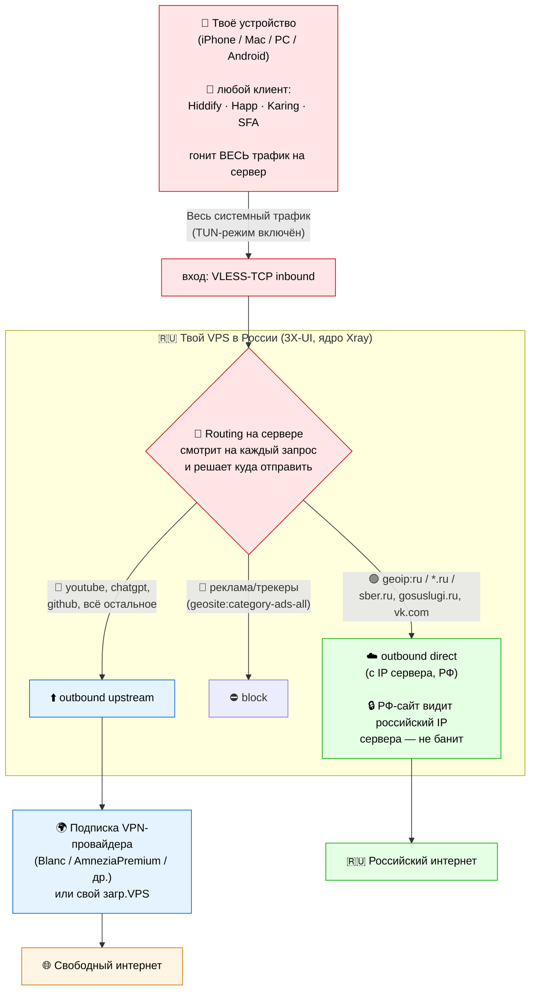
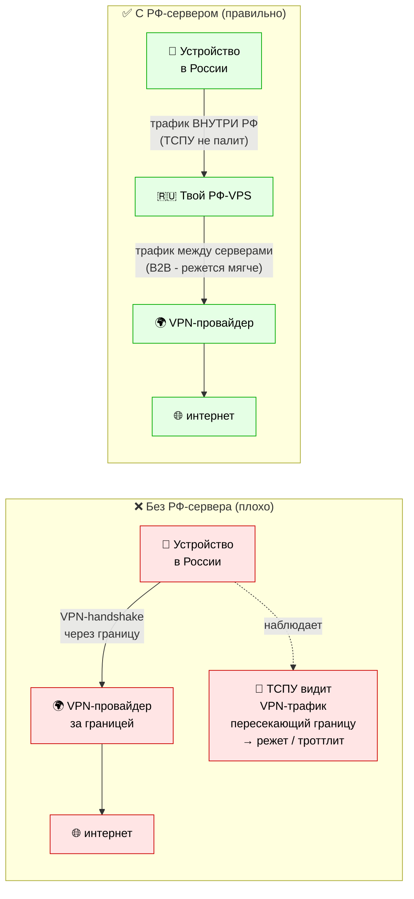
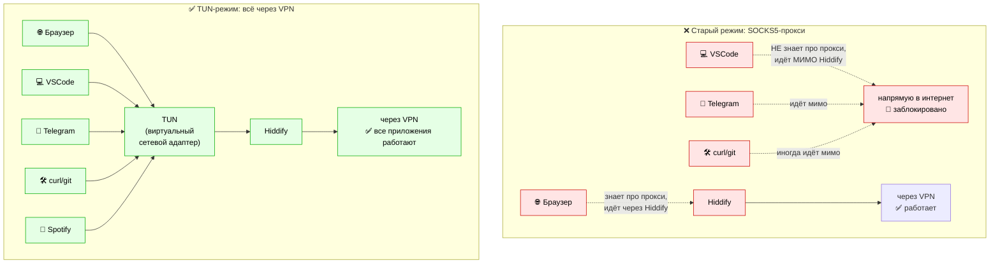
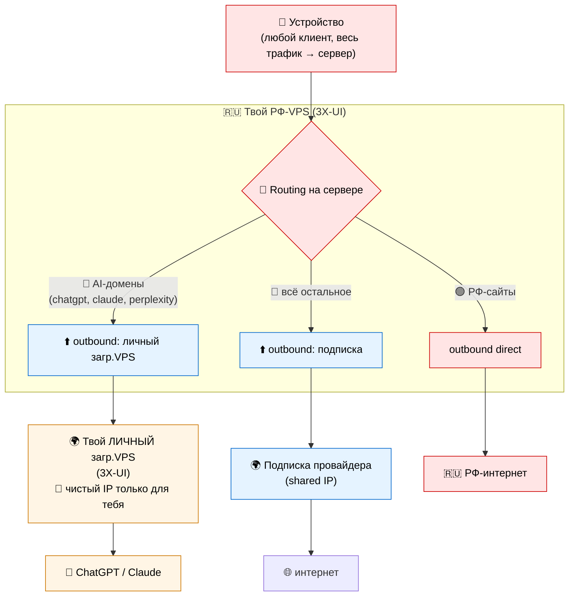
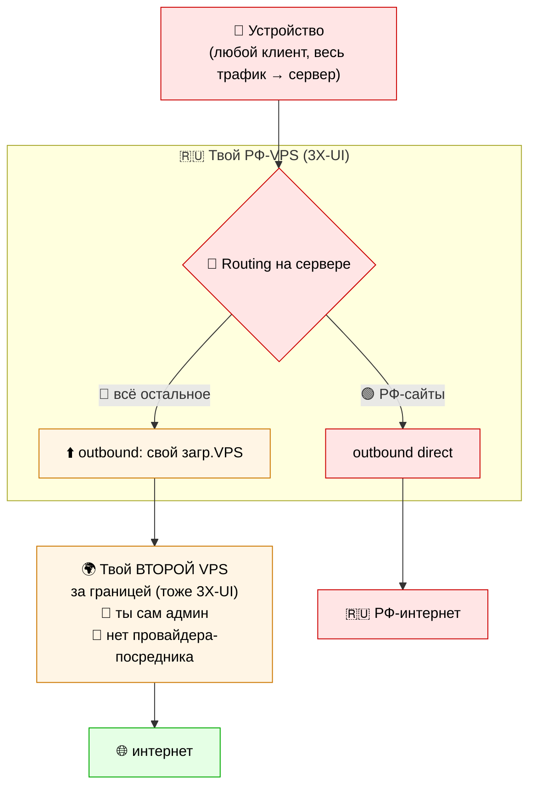

# Эталонная VPN-архитектура (домашний сценарий обхода блокировок, РФ-2026)

Схема «включил и забыл» — один тумблер в клиенте, дальше всё работает само.
Вся маршрутизация (что куда) — **на сервере**, клиент ничего не настраивает.

---

## Главная схема — что куда идёт (split на сервере)

**Главная идея:**
- Клиент на устройстве гонит **весь** трафик на твой РФ-сервер — он ничего не решает сам
- **Сервер** разбирает: РФ-сайты → direct (с IP сервера), реклама → block, остальное → через провайдера в свободный интернет
- Ты настраиваешь правила **один раз на сервере**; на всех устройствах достаточно подписки и тумблера

> ⚠️ Раньше split рисовался **на клиенте** (Hiddify решает куда). Это не
> заработало на практике — Hiddify не исполняет произвольные правила. Новый
> дефолт — split на сервере (`_reference/routing-server-3xui.md`).
>
> 📡 Цена: РФ-трафик делает лишний hop через сервер (+10-20 мс) и выходит с IP
> сервера, а не домашним. Для Госуслуг/Сбера это ок. Прямой выход РФ-трафика —
> только при on-device split (для энтузиастов, `_reference/routing-on-device-singbox.md`).

---

## Зачем «крюк» через свой РФ-сервер?

Логичный вопрос: зачем городить «устройство → РФ-сервер → провайдер → интернет», если можно сразу «устройство → провайдер → интернет»?

**Слева (плохо):** VPN-handshake пересекает границу РФ → ТСПУ это видит → начинает резать или дросселировать.

**Справа (правильно):** трафик от тебя до своего РФ-VPS идёт **внутри РФ** — ТСПУ к таким маршрутам относится мягко. Дальше с РФ-VPS идёт «B2B-трафик между серверами», который тоже под более мягкой фильтрацией. Получаем стабильное соединение.

Это и есть смысл «крюка» — обход агрессивной фильтрации трансграничного VPN-трафика.

---

## TUN-режим — почему ВСЁ работает, а не только браузер

**В чём проблема старого режима SOCKS5:**
- Hiddify запускает локальный «прокси» на `127.0.0.1:1080`
- Браузер знает что есть системный прокси → идёт через него
- VSCode, Telegram desktop, Spotify, curl → **не знают** что есть прокси → идут напрямую → попадают под блокировки

**Как лечит TUN:**
- TUN — это **виртуальный сетевой адаптер** в твоей системе
- Когда он включён, операционная система отправляет **ВЕСЬ исходящий трафик** через него
- Hiddify забирает всё что попадает в TUN и пропускает через свою маршрутизацию
- Приложения ничего не знают и не подозревают — они просто отправляют пакеты, а ядро ОС всё перенаправляет

**Default — только TUN.** SOCKS5-режим не используем.

---

## Опциональное расширение А: отдельный outbound для AI

Если хочешь чтобы Claude/ChatGPT/Perplexity видели **только твой персональный IP** (не shared с другими клиентами Blanc, не «грязный» от чужих ботов) — добавляешь второй outbound на свой собственный заграничный VPS.

Это требует:
- Свой загр.VPS (~800-1500₽/мес)
- Установить на нём вторую панель 3X-UI (это сделает агент-сисадмин)
- В РФ-панели добавить второй outbound на свой загр.VPS
- В правилах: AI-домены → этот личный outbound, остальное → подписка провайдера

**Когда нужно:**
- У тебя несколько аккаунтов AI и есть опасение что они «слипнутся» по shared IP
- AI начали тебя банить (но обычно причина не в IP)

**Когда НЕ нужно:**
- Стандартный сценарий — это избыточно
- В большинстве случаев достаточно подписки провайдера

---

## Опциональное расширение Б: вообще без подписки провайдера

Если хочешь **полную независимость** от платных VPN-провайдеров и согласен сам админить — можно вместо подписки поставить свой второй сервер за границей. Тогда не платишь провайдеру вообще, только за два VPS (РФ + заграница).

**📌 Что это значит на практике:**
- Платишь только за **два своих VPS** (РФ ~300₽/мес + заграница ~800-1500₽/мес = 1100-1800₽/мес)
- НЕ платишь VPN-провайдеру отдельно
- Полная privacy — никакой третьей стороны не видит твой трафик
- НО **админить оба сервера придётся самостоятельно** (с помощью агента-сисадмина):
  - Обновления панели 3X-UI на обоих
  - Следить за «грязностью» IP загр.VPS (если попал в blocklist Anthropic — менять)
  - Ротировать ключи Reality раз в несколько месяцев
  - Когда меняются правила блокировок РКН — переконфигурировать
- VPN-провайдер всё это делает **за тебя**. Свой сервер = больше контроля, но больше работы

**Когда выбирать этот путь:**
- Готов разобраться и взять на себя поддержку (агент-сисадмин помогает, но решения принимаешь ты)
- Хочешь полную приватность от провайдеров
- В долгосроке экономишь (провайдер 500-700₽/мес × 12 = 6000-8400₽/год, второй VPS 800-1500₽/мес × 12 = 9600-18000₽/год — выходит **дороже** в краткосроке, но без зависимости от третьей стороны)

**Когда НЕ выбирать:**
- Новичок — лучше начать с подписки провайдера, потом мигрировать если захочется
- Не хочешь думать про администрирование вообще
- Хочешь чтобы поломки решал не ты, а саппорт провайдера

---

*Связи:*
- *Сценарий консультации (hub) → `_reference/vpn-consultation-flow.md`*
- *Маршрутизация на сервере (дефолт) → `_reference/routing-server-3xui.md`*
- *Маршрутизация on-device → `_reference/routing-on-device-singbox.md`, `_reference/routing-on-device-xray.md`*
- *Технические детали протоколов → `_reference/vpn-protocols.md`*
- *Транспорты и fronting → `_reference/transports.md`, `_reference/fronting-strategies.md`*
- *Фронт блокировок РФ → `_live/frontline-ru.md`*
